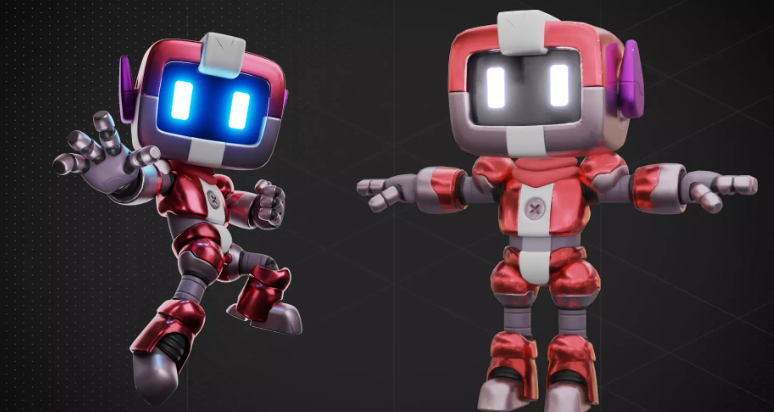
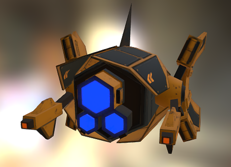
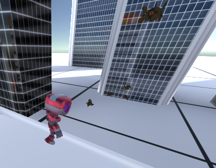

# GDD Drone Attack
• <b>Título:</b>  Drone Attack  
• <b>Estudio/Diseñadores:</b>  Nicolás Álvarez Romero 
• <b>Género: Tipo del juego:</b>  Indie 
• <b>Plataforma:</b>  PC  
• <b>Qué hardware se requiere:</b> 
Procesador: Intel Core i5-2500K / AMD FX-8350 
Memoria RAM: 6 GB DDR3. 
Tarjeta gráfica: Compatible con DirectX 11 y con 2 GB de VRAM como mínimo. AMD Radeon HD 7970 / NVIDIA GeForce GTX 680. 

• <b>Versión:</b>  1.0 
• <b>Sinopsis de Jugabilidad y Contenido:</b>  La ciudad está siendo atacada por un ejército de drones. Defiendela con el uso de un robot. 
• <b>Categoría:</b>  Comparar con uno o varios juegos existentes y diferencias. 
• <b>Licencia:</b>  Original. 
• <b>Mecánica:</b>  Control por mando, teclado y ratón. 
• <b>Tecnología:</b>  Unity. C# 
• <b>Público:</b>  Es un juego casual dirigido a niños y adolescentes de entre 13 y 17 años. 

• <b>Historial de versiones:</b>  El GDD es un artefacto que estará sujeto a cambios. 
Debe haber un control para las versiones del documento y de los cambios. 
• <b>Visión general del juego:</b>  Establecer la visión y el enfoque (del juego) que guiará al proyecto hasta el final del proceso. Debe mencionar lo más
interesante, las ventajas y lo original del juego. 
<b>¿Por qué las personas jugarían este juego?</b> 
Es un excelente forma de pasar el rato controlando al robot por la ciudad atacando drones y saltando a edificios. 

## MECÁNICA DEL JUEGO
Describe lo que el jugador puede hacer y cómo puede hacerlo: acciones del
jugador, su secuencia de acciones en el juego. 

• <b>Cámara:</b>  La cámara es en tercera persona, podrá rotar la visión alrededor del personaje usando teclado y ratón o incluso un mando. 
• <b>Controles:</b>  Para el movimiento del personaje se usarán las teclas WASD y el ratón. Para el salto habrá que presionar espacio cerca de un edificio. Y para disparar click izquierdo, solo si hay un enemigo cerca. 

Con mando se usará el joystick izquierdo. Para el salto habrá que presionar X cerca de un edificio. Y para disparar RT, solo si hay un enemigo cerca.

• <b>Guardar/Cargar:</b>  Cada partida es totalmente nueva. No hay ningún progreso guardado. 

## ESTADOS E INTERFACES

Drone attack no contiene ninguna interfaz ni menú. 

El juego tiene tonos muy claros y luminoso. En contraste con el rojo del personaje pensado para destacar sobre el entorno. 

• <b>Nombre de la Pantalla:</b> Main game 
• <b>Descripción de la Pantalla:</b> Juego principal 
• <b>Estados del Juego:</b> Cuando empiezas el juego apareces en esta escena. 

## NIVELES
Se enumera de manera secuencial el flujo los eventos o niveles que el jugador
debe de pasar para progresar en el juego. Si hay distintos modos de juego, se
requieren varias listas y/o diagramas. ¿Se deben cumplir objetivos para
progresar en el juego? ¿Cambian a razón de la dificultad? ¿Los objetivos
siguen siendo los mismos?

• <b>Título del Nivel:</b> Defiende la ciudad. 
• <b>Encuentro:</b> Primer nivel, apareces en una ciudad, y debes defender la ciudad de las oleadas de ataques de drones 
• <b>Objetivos:</b> Eliminar los drones aparecidos en esa ronda 
• <b>Enemigos por nivel:</b> Cada nivel aparecen más drones 

– <b>Items:</b> Rayos láser y botas propulsoras 
– <b>Personajes:</b>  
    - Enemigos: Drones 
    - Personaje controlado: Robot jammo 

## PERSONAJES 
Los personajes principales y secundarios que aparecerán en el juego.  

• <b>Nombre del Personaje:</b> JAMMO ROBOT 
• <b>Descripción:</b> Es un pequeño robot de color rojo 
  

• <b>Concepto:</b> Es el protagonista del juego. Protege su ciudad natal del ataque de un ejército de drones. 
• <b>Encuentro:</b> Nada más empezar el juego 
• <b>Armas e Items:</b> El robot usa rayos láser lanzados por sus ojos y unas botas propulsoras para saltar a lso edificios. 
• <b>NPC:</b> Movimiento controlado 
<b>Inteligencia:</b> El disparo es inteligente, predice el movimiento de los drones, que se mueven en cualquier dirección. 
Y el salto también en inteligente, calcula la fuerza necesaria para alcanzar la altura del edificio que tiene delante. 

• <b>Nombre del Personaje:</b> DRON  
• <b>Descripción:</b> Es un dron, que vienen en oleadas a destruir la ciudad natal de nuestro protagonista.  
  

• <b>Concepto:</b> Es el villano del juego 
• <b>Encuentro:</b> En cuanto nuestro protagonista encuentra el foco del ataque en la ciudad. 
• <b>Armas e Items:</b> Carga contra los edificios a gran velocidad 
• <b>NPC:</b> Movimiento físico 

## ENTORNO
• <b>GUIÓN:</b> La ciudad natal de nuestro robot Jammo está siendo atacada por oleadas y oleadas de drones de ataque. Jammo tiene que destruir todos ellos y salvar su ciudad. Para ello se moverá por la ciudad disparando a estos enemigos. 
• <b>IMÁGENES DE CONCEPTO:</b> 
  

## RECURSOS DE DESARROLLO

• <b>MIEMBROS DEL EQUIPO:</b> Nicolás Álvarez Romero 
• <b>Fecha de Inicio:</b> 11/06/2022 
• <b>Fecha de Terminación:</b> 26/06/2022 